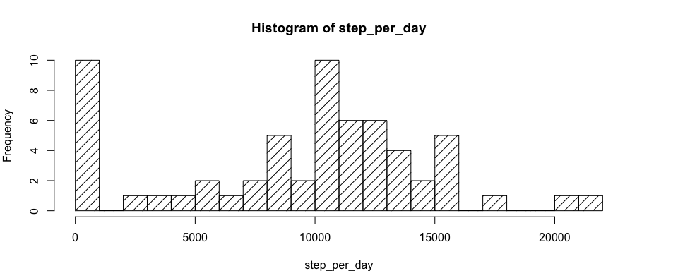
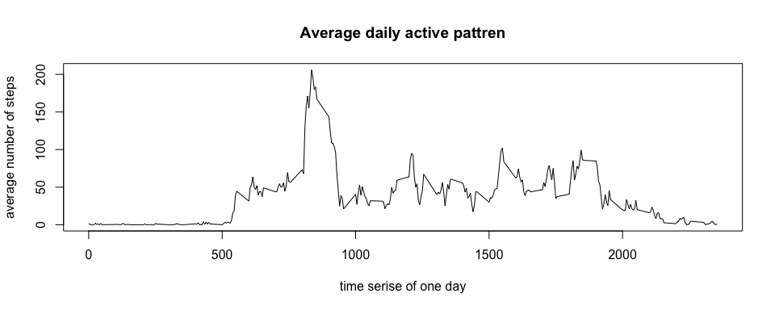
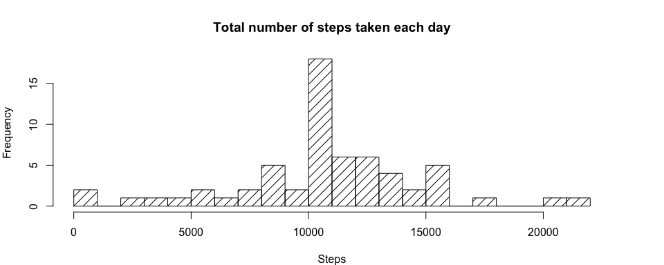

# Reproducible Research: Peer Assessment 1

## Loading and preprocessing the data

```r
unzip('activity.zip')
ori_data<- read.csv(file = 'activity.csv')
head(ori_data)
```

```
##   steps       date interval
## 1    NA 2012-10-01        0
## 2    NA 2012-10-01        5
## 3    NA 2012-10-01       10
## 4    NA 2012-10-01       15
## 5    NA 2012-10-01       20
## 6    NA 2012-10-01       25
```

## What is mean total number of steps taken per day?
Calculate the total number of steps taken per day and visualize the data by generating a histogram. 

```r
step_per_day<-with(ori_data,tapply(steps,date,sum,na.rm=TRUE))
par(mar=c(4,4,4,4))
hist(step_per_day,
     breaks=20,
     density = 10,
     xlab = 'Steps',
     main = 'Total number of steps taken each day')
```

<!-- -->


```r
med_step<-median(step_per_day)
```
The median of total number of steps taken per day is 10395

```r
mean_step<-mean(step_per_day)
```
The mean of total number of steps taken per day is 9354.2295082

## What is the average daily activity pattern?
Make a time serise plot below to show the pattern of daily average steps of the 5-minutes interval. The max value of steps is between 500 and 1000 intervals.

```r
inter_mean_step<-with(ori_data,tapply(steps,interval,mean,na.rm=TRUE))
xaxis<-unique(ori_data$interval)
plot(xaxis,
     inter_mean_step,
     type = 'l',
     xlab = 'time serise of one day',
     ylab= 'average number of steps',
     main = 'Average daily active pattren')
```

<!-- -->
The code below is to calculate the maximum number of steps in the inter_mean_step dataset. 

```r
df<-data.frame(time = unique(ori_data$interval), step = inter_mean_step)
max_step_time<-subset(df,step==max(df[,2]))$time
```
Across all the days in the dataset 835 interval contains the maximum number of steps on average.  

## Imputing missing values
#### Calculate the total number of missing values in the dataset.

```r
total_na<-sum(is.na(ori_data[,1]))
```
There are 'r total_na' NAs in the dataset

#### Create a new dataset without missing data.

```r
data1<-data.frame(ori_data)
for(i in 1:nrow(data1)){
        if(is.na(data1[i,1])){
                var1<-df$time==data1[i,3]
                #### Fill in all of the missing values in the dataset.
                data1[i,1]<-df[which(var1),2]
        }
}
```

#### Make a histogram of the total number of steps

```r
sum_step_data<-with(data1,tapply(steps,date,sum))
par(mar=c(4,4,4,4))
hist(sum_step_data,
     breaks=20,
     density = 10,
     xlab = 'Steps',
     main = 'Total number of steps taken each day')
```

<!-- -->


```r
med_step1<-as.integer(median(sum_step_data))
```
The median of total number of steps taken per day is 10766

```r
mean_step1<-as.integer(mean(sum_step_data))
```
The mean of total number of steps taken per day is 10766
The mean and median values are differ from the estimates from the first part of the report. Imputing missing data make the 

## Are there differences in activity patterns between weekdays and weekends?
